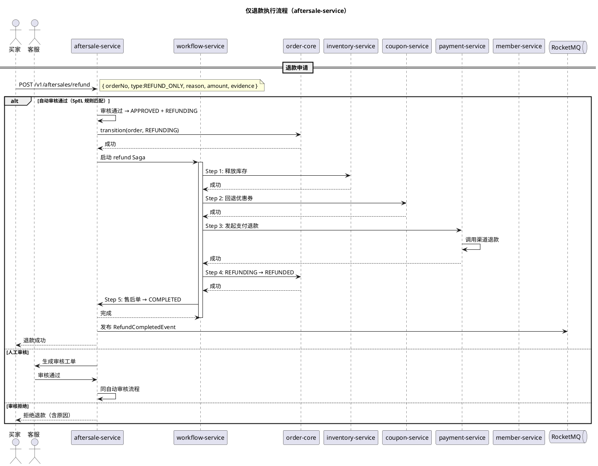
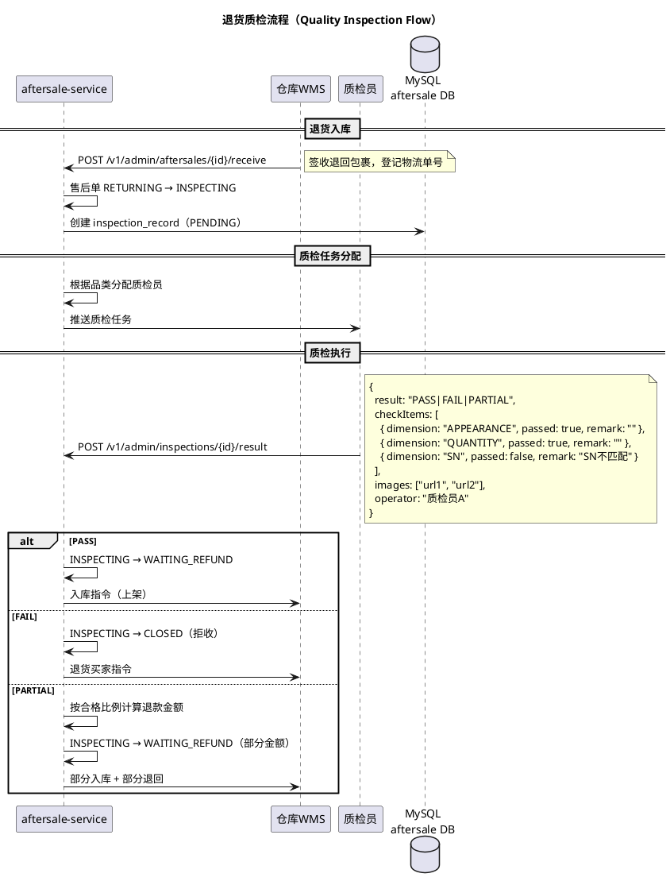

# ADR-048：售后服务 (Aftersale Service)

> **状态**: 已接受  
> **创建日期**: 2026-06-13  
> **影响范围**: aftersale-service（售后服务）、order-core、payment-core、inventory-service、coupon-service、logistics-service、notification-service
>
> **本文档系统设计订单中台的售后服务，涵盖售后状态机、退款/退货/换货三类流程、自动审核规则引擎、退货质检（入库检查）、售后物流、Saga 集成以及数据模型。**

---

## 1. 背景

### 现状分析

售后是订单中台最复杂的业务域之一，但当前仅散落在服务引用中：

| # | 问题 | 现象 | 影响 |
|---|------|------|------|
| P1 | **无独立 ADR** | aftersale-service 容器图中存在（第 35 行）但无设计文档 | 无法落地实现 |
| P2 | **无售后状态机** | 仅有充值流（refund-flow.puml），缺退货/换货完整流程 | 退货/换货各团队各自实现 |
| P3 | **无质检流程** | 退货后是否需要质检、质检什么无定义 | 退回商品状态不明 |
| P4 | **无自动审核规则** | 退款金额和条件自动判定缺定义 | 退款全量人工审核 |
| P5 | **无换货流程** | 换货涉及新订单生成 + 新物流 + 旧货回收，完全缺失 | 换货功能无法上线 |

### 现有引用

| 引用 | 位置 | 内容 |
|------|------|------|
| aftersale-service 容器 | container-diagram.puml | `Container(aftersale, "aftersale-service", ...)` |
| refund-flow.puml | diagrams/sequence/refund-flow.puml | 退款 Saga 编排（审核→状态→库存→券→支付→结算） |
| ADR-039 状态机 | ADR-039 §2 | 13 态订单状态机中定义 REFUNDING/RETURNING/REFUNDED |
| ADR-039 RefundReconcileJob | ADR-039 §6 | 30min 扫描卡住 REFUNDING/RETURNING 超时订单 |
| ADR-039 ConfirReceiptService | ADR-039 §3.5 | 确认收货后走售后流程：`COMPLETED → RETURNING` |
| ADR-042 退款接口 | ADR-042 §4.3 | `payment.refund()` 发起退款 + `refund_order` 表 |
| ADR-042 退款对账 | ADR-042 §6.1 | 支付单与渠道账单对账覆盖退款交易 |
| ADR-020 退款 Saga | ADR-020 §3 | releaseCoupon 补偿步骤 |
| ADR-045 券回退 | ADR-045 §7.4 | 退款 Saga 明确包含 coupon.rollback |
| ADR-030 幂等框架 | ADR-030 | refund callback Idempotency-Key |
| completeness-report §4.6 | §4.6 | "售后无独立 ADR，需补齐" |

### 功能缺口映射

| 缺口 | 来源 | 对应设计 |
|------|------|---------|
| 退款流程（原路退回/钱包余额） | completeness-report §4.6 | 本 ADR §4 仅退款 |
| 退货质检/入库流程 | completeness-report §4.6 | 本 ADR §6 质检 |
| 换货流程 | completeness-report §4.6 | 本 ADR §5 换货 |
| 售后原因统计 | completeness-report §4.6 | 本 ADR §9.4 数据看板 |
| 售后单生命周期 | completeness-report §4.6 | 本 ADR §3 售后状态机 |

---

## 2. 目标

| # | 目标 | 衡量标准 |
|---|------|---------|
| G1 | 售后类型覆盖 | 支持 REFUND_ONLY / RETURN_REFUND / EXCHANGE 三种类型 |
| G2 | 售后单状态机 | 独立状态机，覆盖售后单全生命周期 |
| G3 | 自动审核规则 | SpEL 引擎 + Apollo 可配规则，PASS 率 ≥ 60% |
| G4 | 退货质检流程 | 三种质检结果（PASS / FAIL / PARTIAL），支持入库/拒收 |
| G5 | 换货流程 | 旧货回收 + 新单生成 + 新物流发运，Saga 保障 |
| G6 | Saga 集成 | 退款/换货 Saga 完整补偿定义 |
| G7 | 数据闭环 | 售后单 ↔ 退款记录 ↔ 质检 ↔ 换货，端到端可追溯 |

---

## 3. 战术 DDD 设计

### 3.1 聚合根

| 聚合根 | 数据库表 | 标识符 | 生命周期 |
|--------|---------|--------|---------|
| **AftersaleOrder** (售后单) | aftersale_order | aftersale_no (String, prefix=AS) | 创建→审核→收货/退款→完成/关闭，独立状态机 |
| **InspectionRecord** (质检记录) | inspection_record | inspection_id (Long, auto) | 随售后类型 RETURN_REFUND/EXCHANGE 生成 |
| **ExchangeOrder** (换货单) | exchange_order | exchange_no (String, prefix=EX) | 旧货回收→新单创建→新单发货→完成 |

### 3.2 Entity vs Value Object

| 类型 | 名称 | 标识 | 原因 |
|------|------|------|------|
| **Entity** | AftersaleOrder | aftersale_no | 独立状态机，10 个状态全生命周期管理 |
| **Entity** | InspectionRecord | inspection_id | 质检状态（PENDING→INSPECTING→PASS/FAIL/PARTIAL） |
| **Entity** | ExchangeOrder | exchange_no | 换货生成的新订单，重新发货有独立物流 |
| **Value Object** | RefundAmount | total + shipping + balance | 退款金额计算快照 |
| **Value Object** | ReturnAddress | province + city + district + detail | 退货地址，记录售后申请时的快照 |
| **Value Object** | InspectionResult | result + photos + description | 质检结果快照，不可变 |
| **Value Object** | AuditRuleResult | rule_id + decision + priority | 审核规则匹配结果，无身份标识 |

### 3.3 领域事件

| 事件 | 触发点 | 消费者 |
|------|--------|--------|
| `AftersaleCreated` | 售后申请提交 | notification (通知商家) |
| `AftersaleAutoApproved` | 自动审核通过 | payment (发起退款), workflow (启动 Saga) |
| `AftersaleAutoRejected` | 自动审核拒绝 | notification (通知买家拒由) |
| `AftersaleManualReview` | 转入人工审核 | 客服工单系统 |
| `AftersaleRefundCompleted` | 退款完成 | order-core (推进订单 REFUNDED) |
| `AftersaleInspectionCompleted` | 质检完成 | logistics (触发退货发货/换货发新) |
| `AftersaleExchangeShipped` | 换货已发货 | order-core (换货订单状态同步) |
| `AftersaleClosed` | 售后单关闭 | order-core, payment, inventory, coupon |

### 3.4 不变条件（Invariants）

| 规则 | 约束 | 保障方式 |
|------|------|---------|
| 一个订单同时只能有一种进行中的售后 | order_no 维度防重 | aftersale_order.order_no + status NOT IN (终态) 唯一约束 |
| 退款总额 ≤ 订单实付金额 | sum(refunds) <= actual_pay_amount | 退款服务校验 |
| 换货新订单与原始订单不同 | 新订单不继承原订单售后状态 | 应用层规则 |
| 质检一次后不可重置 | inspection_record 写入后不可修改 | 业务约束 |

### 3.5 Repository 模式

```
AftersaleOrderRepository (Interface)  // Domain 层定义
  └── AftersaleOrderDBRepository (OB, MyBatis-Plus 实现)

InspectionRecordRepository (Interface)
  └── InspectionRecordDBRepository (OB)

ExchangeOrderRepository (Interface)
  └── ExchangeOrderDBRepository (OB)
```

---

## 4. 决策

### 决策 1：售后体系架构

| 方案 | 评估 |
|------|------|
| **订单状态机扩展**（在订单上增加更多售后态） | 订单状态已 13 态，继续膨胀增加复杂度，订单和售后职责混合 ❌ |
| **独立售后状态机**（aftersale-service 维护独立售后单） | ✅ **选中** — 售后单与订单分离，aftersale_order 独立表，通过 `order_no` 关联；订单只需关注订单级售后终态（REFUNDING/RETURNING/REFUNDED），具体流程由售后单管理 |
| **完全独立服务**（售后微服务独立 DB 独立状态机） | 同上，架构清晰，#cc6666 |

**核心设计原则**：aftersale-service 持有售后单的完整状态，订单状态机仅维护与订单生命周期相关的售后"门面状态"。售后单从创建到关闭的详细流程对外部透明。

### 决策 2：售后类型模型

| 类型 | 说明 | 退货物流 | 质检 | 退款 | 换货发新 |
|------|------|---------|------|------|---------|
| **REFUND_ONLY**（仅退款） | 不退货，直接退款（虚拟商品/协商一致） | 无 | 无 | ✅ | 无 |
| **RETURN_REFUND**（退货退款） | 用户退货→质检→退款 | 用户寄回 | ✅ | ✅ | 无 |
| **EXCHANGE**（换货） | 用户退货→质检→发新货 | 用户寄回 + 新货发出 | ✅ | 无 | ✅ |

### 决策 3：售后状态机

aftersale-service 独立状态机，与订单状态机的 REFUNDING/RETURNING/REFUNDED 保持单向同步：

```
                 ┌──────────┐
                 │ PENDING  │  ← 发起售后申请
                 └────┬─────┘
                      │
              ┌───────┴───────┐
              │               │
         ┌────▼────┐    ┌────▼────┐
         │AUDITING  │    │AUDITING │  ← 自动/人工审核中
         │(AUTO)    │    │(MANUAL) │
         └────┬─────┘    └────┬─────┘
              │               │
              └───────┬───────┘
                      │
           ┌──────────┴──────────┐
           │                     │
      ┌────▼────┐          ┌────▼────┐
      │REJECTED │          │ APPROVED│  ← 审核通过
      └─────────┘          └────┬────┘
                                │
                  ┌─────────────┼─────────────┐
                  │             │             │
             ┌────▼───┐   ┌────▼───┐   ┌────▼───┐
             │REFUND  │   │RETURN  │   │EXCHANGE│  ← 按类型分叉
             │(直接)  │   │(退货)  │   │(换货)  │
             └────┬───┘   └────┬───┘   └────┬───┘
                  │            │             │
                  │       ┌────▼────┐   ┌────▼────┐
                  │       │INSPECT  │   │INSPECT  │  ← 退货/换货需质检
                  │       │(质检)   │   │(质检)   │
                  │       └────┬────┘   └────┬────┘
                  │            │             │
                  │       ┌────▼────┐   ┌────▼────┐
                  │       │PASS/FAIL│   │PASS/FAIL│
                  │       └────┬────┘   └────┬────┘
                  │            │             │
                  │       ┌────▼────┐   ┌────▼────┐
                  │       │REFUND   │   │SHIP_NEW │  ← 退款/发新货
                  │       └────┬────┘   └────┬────┘
                  │            │             │
                  └──────┬─────┘             │
                         │                   │
                    ┌────▼───────────────────▼────┐
                    │        COMPLETED            │  ← 售后完成（终态）
                    └──────────────┬──────────────┘
                                   │
                              ┌────▼────┐
                              │  CLOSED │  ← 取消/超时关闭（终态）
                              └─────────┘
```

#### 状态定义

| 状态 | 含义 | 是否终态 | 最大停留时间 | 超时处理 |
|------|------|---------|------------|---------|
| `PENDING` | 售后申请已提交 | 否 | 30min | 自动触发审核 |
| `AUDITING` | 自动/人工审核中 | 否 | 24h（人工） | P2 告警超时未审核 |
| `APPROVED` | 审核通过 | 否 | 立即分流 | — |
| `REJECTED` | 审核拒绝 | ✅ 是 | — | — |
| `REFUNDING` | 退款处理中 | 否 | 72h | 触发 RefundReconcileJob |
| `RETURNING` | 退货寄回中（等待买家寄回） | 否 | 7d | 自动关闭逾期待寄回 |
| `INSPECTING` | 质检中（仓库验收） | 否 | 48h | P2 告警质检超时 |
| `WAITING_REFUND` | 质检通过待退款 | 否 | 24h | 自动触发退款 |
| `SHIPPING_NEW` | 换货新商品发货中 | 否 | 72h | P2 告警发货超时 |
| `COMPLETED` | 售后完成（终态） | ✅ 是 | — | — |
| `CLOSED` | 售后关闭/取消（终态） | ✅ 是 | — | — |

#### 状态转换矩阵

行 = 当前状态，列 = 目标状态。

| 当前 \ 目标 | AUDITING | APPROVED | REJECTED | REFUNDING | RETURNING | INSPECTING | WAITING_REFUND | SHIPPING_NEW | COMPLETED | CLOSED |
|------------|:--------:|:--------:|:--------:|:---------:|:---------:|:----------:|:--------------:|:------------:|:---------:|:------:|
| **PENDING** | ✅ 审核 | ✅ 通过 | | | | | | | | ✅ 取消 |
| **AUDITING** | | ✅ 自动/人工通过 | ✅ 拒绝 | | | | | | | |
| **APPROVED** | | | | ✅ 仅退款 | ✅ 退货申请 | | | ✅ 换货 | | ✅ 取消 |
| **REFUNDING** | | | | | | | | | ✅ 退款成功 | ✅ 退款失败关闭 |
| **RETURNING** | | | | | | ✅ 签收入仓 | | | | ✅ 超时未寄回 |
| **INSPECTING** | | | | | | | ✅ 质检通过 | ✅ 换货(质检通过) | | ✅ 质检不通过拒收 |
| **WAITING_REFUND** | | | | | | | | | ✅ 退款成功 | |
| **SHIPPING_NEW** | | | | | | | | | ✅ 换货完成 | |
| **COMPLETED** | | | | | | | | | — | |
| **CLOSED** | | | | | | | | | | — |

### 决策 4：订单状态单向同步规则

aftersale-service 在关键节点将状态写回 order-core，通过 Dubbo RPC 调用订单状态机引擎：

| 售后节点 | 订单目标状态 | 触发条件 |
|---------|------------|---------|
| 售后单 APPROVED (REFUND_ONLY) | `REFUNDING` | 仅退款审核通过即触发 |
| 售后单 APPROVED (RETURN_REFUND) | `RETURNING` | 退货审核通过即触发 |
| 售后单 APPROVED (EXCHANGE) | `RETURNING` | 换货审核通过即触发 |
| 售后单 COMPLETED | `REFUNDED` | 退款成功或换货完成 |

> 此规则是单向的：aftersale → order-core。反向由 order-core 的卡单检测器（RefundReconcileJob）触发——发现订单 REFUNDING/RETURNING 但无对应售后单时告警。

### 决策 5：自动审核规则引擎

| 方案 | 评估 |
|------|------|
| **硬编码条件** | 每次改规则需发版，❌ 不具备灵活性 |
| **SpEL 表达式 + Apollo 配置** | ✅ **选中** — 与 ADR-045 规则引擎一致，Apollo 配置可热更新 |
| **Drools 规则引擎** | 依赖重（100MB+），订单中台不适合 ❌ |

```yaml
# Apollo 配置: aftersale.audit.rules
aftersale:
  audit:
    rules:
      # 规则 1：小额未发货 → 自动通过
      - name: "小额未发货自动退款"
        condition: "amount <= 200 && shipped == false && riskScore < 30"
        action: AUTO_APPROVE
        priority: 1

      # 规则 2：高等级会员 → 自动通过
      - name: "高等级会员自动审核"
        condition: "memberTier >= 4 && amount <= 1000"
        action: AUTO_APPROVE
        priority: 2

      # 规则 3：虚拟商品 → 自动通过
      - name: "虚拟商品自动退款"
        condition: "category == 'VIRTUAL' && shipped == false"
        action: AUTO_APPROVE
        priority: 3

      # 规则 4：风控评分高 → 自动拒绝
      - name: "高风险自动拒绝"
        condition: "riskScore >= 80"
        action: AUTO_REJECT
        priority: 4

      # 默认 → 人工审核
      - name: "默认人工审核"
        condition: "true"
        action: MANUAL_REVIEW
        priority: 99
```

### 决策 6：退款路径

| 方案 | 评估 |
|------|------|
| **仅原路退回** | 先调用 payment.refund() → 支付宝/微信原路退回；简单但用户不能选 |❌|
| **原路退回 + 平台余额** | 两种退款方式，用户可指定 |✅ **选中**|
| **原路退回 + 平台积分/储值卡** | 复杂，与会员积分体系耦合 |❌|

**退款优先级**：`原路退回` 为首选（调用 ADR-042 `payment.refund()`）。原路失败时走 `平台余额`，由 aftersale-service 调用 member-service 充值。

### 决策 7：换货生成新订单

| 方案 | 评估 |
|------|------|
| **复用原订单**（修改商品 SKU） | 订单已履约不可修改，计费/物流混乱 ❌ |
| **生成新订单**（aftersale 创建新 order） | ✅ **选中** — 新订单独立生命周期，采用原订单价格+促销快照 |
| **外部换货订单**（独立子系统） | 复杂，与订单中台脱节 ❌ |

换货生成新订单时：价格快照从原订单的 order_discount 表读取，新订单按 `PENDING_PAY → PAID（自动化）→ TO_SHIP → SHIPPED` 流转。原订单保持 `RETURNING` 状态，待旧货退回质检通过后完成。

### 决策 8：售后时效矩阵

| 售后类型 | 超时节点 | 时限 | 超时处理 |
|---------|---------|------|---------|
| 仅退款 | 审核 | 30min 自动触发 | 超时自动标记审核结果（依据规则） |
| 仅退款 | 退款操作 | 72h | RefundReconcileJob 扫描，自动/告警 |
| 退货退款 | 用户寄回 | 7d | 自动关闭（CANCELLED），退款取消 |
| 退货退款 | 仓库质检 | 48h | P2 告警质检超时，催促仓库 |
| 退货退款 | 质检后退款 | 24h | 自动触发退款 |
| 换货 | 用户寄回 | 7d | 自动关闭 |
| 换货 | 新货发货 | 72h | P2 告警发货超时 |

---

## 4. 仅退款流程（REFUND_ONLY）

```
用户申请 → 自动/人工审核 → 退款执行 → 完成
         ↘             ↙
          × (拒绝) → 终态
```

### 4.1 退款执行流程



### 4.2 退款金额限制

| 场景 | 上限规则 |
|------|---------|
| 全额退款 | `refund_amount = order.pay_amount` |
| 部分退款 | `refund_amount <= order.pay_amount - already_refunded` |
| 运费不退还 | 默认规则，Apollo 可配 `shipping.refundable = true/false` |
| 优惠券抵扣部分 | 券已使用 → 券回退（ADR-045 §7.4），不退还现金 |

---

## 5. 换货流程（EXCHANGE）

换货是售后最复杂的流程，涉及旧货回收 + 新货发运两条物理链路：

```
用户申请 → 审核 → 用户寄回旧货 → 签收质检 → 生成新订单 → 新货发运 → 完成
                              ↘       ↙
                               质检不通过 → 拒收退回 → 关闭
```

### 5.1 换货全流程

```puml
@startuml
title 换货流程（Exchange Flow）

actor "买家" as buyer
actor "仓库" as warehouse
participant "aftersale-service" as aftersale
participant "order-core" as order
participant "workflow-service" as wf
participant "logistics-service" as logistics
participant "inventory-service" as inv
participant "payment-service" as payment
queue "RocketMQ" as mq

== 换货申请 ==
buyer -> aftersale: POST /v1/aftersales/exchange
note right: { orderNo, targetSkuId, quantity, reason }

aftersale -> aftersale: 校验 SKU 是否可换（同品类/同价格）
aftersale -> aftersale: 审核规则判定

alt 审核拒绝
    aftersale --> buyer: 拒绝换货
    end
end

== 审核通过 + 用户寄回 ==
aftersale -> aftersale: APPROVED + RETURNING
aftersale -> order: transition(order, RETURNING)

aftersale -> buyer: 生成退货地址（仓库地址 + 退货码）
buyer -> logistics: 用户寄回（自行寄回/上门取件）
note right #ff8: RETURNING 状态，7d 超时自动关闭

== 仓库签收 + 质检 ==
warehouse -> aftersale: POST /v1/admin/inspect (退回商品签收)
alt 质检通过
    aftersale -> aftersale: INSPECTING → WAITING_REFUND
    
    == 生成换货新订单 ==
    aftersale -> order: 创建新订单（类型=EXCHANGE）
    note right
        价格快照: 复制原订单价
        无支付: PREPAID 自动过账
        商品: 替换为目标 SKU
    end
    
    aftersale -> inv: reserve(sku, qty)
    inv --> aftersale: 成功
    
    aftersale -> logistics: 新订单发货
    logistics --> aftersale: 物流单号
    
    aftersale -> wf: 启动 exchange Saga (3步)
    activate wf
    wf -> order: Step 1: 新订单 PAID → TO_SHIP → SHIPPED
    wf -> logistics: Step 2: 确认物流
    wf -> aftersale: Step 3: 售后单 → COMPLETED
    deactivate wf
    
    aftersale -> order: transition(原订单, RETURNING → REFUNDED)
    note right: 换货完成，原订单记已退款(无资金)
    
    aftersale -> mq: 发布 ExchangeCompletedEvent
    aftersale --> buyer: 换货已发新

else 质检不通过
    aftersale -> aftersale: INSPECTING → CLOSED（拒收）
    buyer -> logistics: 旧货退回买家
    aftersale --> buyer: 质检不通过，旧货退回
end

@enduml
```

### 5.2 换货价格快照

```yaml
exchange-pricing:
  strategy: SNAPSHOT_ORIGINAL     # 使用原订单价
  snapshot-sources:
    - order_discount 表的价格分摊记录
    - 原订单的 promotion_activity 快照（fix）
    - 原订单的 coupon_instance 使用记录
  adjustment:
    diff-rules:                    # 新旧 SKU 价差处理
      - condition: "newPrice > originalPrice"
        action: COLLECT_DIFF       # 换高价商品 → 买家补差价
        payment: buyer_pay_diff
      - condition: "newPrice < originalPrice"
        action: NO_REFUND          # 换低价商品 → 不退款差价（默认规则）
  shipping: 
    - orig_order_shipping_free = true → new_order_shipping_free = true
```

### 5.3 换货 Saga 补偿

| Step | 正向操作 | 补偿操作 |
|------|---------|---------|
| 1. 新订单前置到 PAID | transition(new_order, PAID) | 取消新订单 → CANCELLED |
| 2. 新订单发货 | 生成物流单号 | 拦截物流（如未揽收）或无法拦截 |
| 3. 原订单→REFUNDED | transition(orig, REFUNDED) | 回滚至 RETURNING |
| 4. 旧货退回用户 | 生成退回物流单 | 拦截退回物流 |

> **Saga 补偿边界**：Step 3 后旧货已不可退（仓库已入库），此时 Saga 失败需人工介入。

---

## 6. 退货质检流程

### 6.1 质检项定义

| 质检维度 | 内容 | 标准 |
|---------|------|------|
| 外观检查 | 外包装完整性、商品外观 | 无严重破损、无明显使用痕迹 |
| 配件检查 | 附件/赠品/说明书齐全 | 按商品 SKU 属性配置 |
| 功能检查 | 商品基本功能正常 | 通电测试/功能验证（按品类） |
| 序列号校验 | 退回 SN 与发货 SN 一致 | 发货时记录 SN，退回时扫描验证 |
| 数量检查 | 退回数量与申请一致 | 逐一清点 |

### 6.2 质检结果判定

| 结果 | 操作 | 影响 |
|------|------|------|
| PASS（合格） | 入库 → 触发退款/换货发货 | 全额退款 / 发新货 |
| FAIL（不合格） | 拒收 → 退回买家 | 售后关闭，不退款 |
| PARTIAL（部分合格） | 部分入库 + 部分退回 | 按合格比例部分退款 |

```yaml
# Apollo 配置: aftersale.inspection.rules
aftersale:
  inspection:
    auto_rules:
      # 虚拟/数字商品 → 自动通过
      - condition: "category in ('VIRTUAL', 'DIGITAL')"
        result: PASS
      # 高价商品→必须全部检查
      - condition: "amount >= 5000"
        required_checks: [ALL]
      # 低价值快速检查
      - condition: "amount < 200 && category == 'GROCERY'"
        required_checks: [APPEARANCE, QUANTITY]
```

### 6.3 质检队列 + 仓内集成



---

## 7. 数据模型

### 7.1 售后单主表（aftersale_order）

```sql
CREATE TABLE aftersale_order (
    id                  BIGINT        AUTO_INCREMENT PRIMARY KEY,
    aftersale_no        VARCHAR(32)   NOT NULL COMMENT '售后单号，Snowflake 生成',
    order_no            VARCHAR(32)   NOT NULL COMMENT '关联订单号',
    buyer_id            BIGINT        NOT NULL COMMENT '买家 ID',
    merchant_id         BIGINT        NOT NULL COMMENT '商家 ID',

    -- 售后类型与状态
    aftersale_type      VARCHAR(16)   NOT NULL COMMENT '售后类型: REFUND_ONLY / RETURN_REFUND / EXCHANGE',
    status              VARCHAR(16)   NOT NULL COMMENT '售后状态: PENDING/AUDITING/APPROVED/REJECTED/REFUNDING/RETURNING/INSPECTING/WAITING_REFUND/SHIPPING_NEW/COMPLETED/CLOSED',

    -- 退款信息
    refund_amount       DECIMAL(12,2) DEFAULT 0.00 COMMENT '退款金额（含部分退款）',
    refund_type         VARCHAR(16)   DEFAULT NULL COMMENT '退款方式: ORIGINAL / BALANCE',
    refund_transaction_id VARCHAR(128) DEFAULT NULL COMMENT '三方退款流水号',

    -- 退货/换货信息
    return_logistics_no VARCHAR(64)   DEFAULT NULL COMMENT '退货物流单号',
    return_address      VARCHAR(256)  DEFAULT NULL COMMENT '退货地址',
    exchange_to_sku     VARCHAR(32)   DEFAULT NULL COMMENT '换货目标 SKU',
    exchange_to_qty     INT           DEFAULT NULL COMMENT '换货数量',
    exchange_new_order_no VARCHAR(32) DEFAULT NULL COMMENT '换货新订单号',

    -- 原因与凭证
    reason_code         VARCHAR(32)   NOT NULL COMMENT '售后原因码',
    reason_detail       VARCHAR(500)  DEFAULT NULL COMMENT '原因详情',
    evidence_json       TEXT          DEFAULT NULL COMMENT '凭证图片/视频 URL 列表',
    buyer_remark        VARCHAR(500)  DEFAULT NULL COMMENT '买家备注',

    -- 审核信息
    audit_rule          VARCHAR(32)   DEFAULT NULL COMMENT '匹配的审核规则名',
    audit_type          VARCHAR(16)   DEFAULT NULL COMMENT '审核类型: AUTO / MANUAL',
    auditor             VARCHAR(64)   DEFAULT NULL COMMENT '审核人',
    audit_time          DATETIME      DEFAULT NULL COMMENT '审核时间',
    reject_reason       VARCHAR(500)  DEFAULT NULL COMMENT '拒绝原因',

    -- 时效
    deadline_at         DATETIME      NOT NULL COMMENT '时效截止时间',
    completed_at        DATETIME      DEFAULT NULL COMMENT '完成时间',

    -- 审计字段
    gmt_create          DATETIME      NOT NULL DEFAULT CURRENT_TIMESTAMP,
    gmt_modified        DATETIME      NOT NULL DEFAULT CURRENT_TIMESTAMP ON UPDATE CURRENT_TIMESTAMP,
    version             INT           NOT NULL DEFAULT 0 COMMENT '乐观锁',

    UNIQUE KEY uk_aftersale_no (aftersale_no),
    KEY idx_order_no (order_no),
    KEY idx_buyer_id (buyer_id),
    KEY idx_status (status),
    KEY idx_deadline (deadline_at),
    KEY idx_completed (completed_at)
) COMMENT '售后单主表';
```

### 7.2 质检记录表（inspection_record）

```sql
CREATE TABLE inspection_record (
    id                  BIGINT        AUTO_INCREMENT PRIMARY KEY,
    aftersale_no        VARCHAR(32)   NOT NULL COMMENT '售后单号',
    order_no            VARCHAR(32)   NOT NULL COMMENT '原订单号',

    -- 质检信息
    status              VARCHAR(16)   NOT NULL DEFAULT 'PENDING' COMMENT 'PENDING / PASS / FAIL / PARTIAL',
    checked_by          VARCHAR(64)   DEFAULT NULL COMMENT '质检员',
    checked_at          DATETIME      DEFAULT NULL COMMENT '质检时间',
    check_items_json    TEXT          DEFAULT NULL COMMENT '检查项明细 JSON',
    images_json         TEXT          DEFAULT NULL COMMENT '质检拍照 URL 列表',
    remark              VARCHAR(500)  DEFAULT NULL COMMENT '质检备注',

    -- 入库结果
    warehouse_action    VARCHAR(32)   DEFAULT NULL COMMENT '入库动作: STORE_IN / RETURN_OUT / PARTIAL_IN',
    warehouse_location  VARCHAR(64)   DEFAULT NULL COMMENT '库位',
    warehouse_operator  VARCHAR(64)   DEFAULT NULL COMMENT '入库操作人',
    warehouse_time      DATETIME      DEFAULT NULL COMMENT '入库时间',

    gmt_create          DATETIME      NOT NULL DEFAULT CURRENT_TIMESTAMP,
    gmt_modified        DATETIME      NOT NULL DEFAULT CURRENT_TIMESTAMP ON UPDATE CURRENT_TIMESTAMP,

    KEY idx_aftersale_no (aftersale_no),
    KEY idx_status (status)
) COMMENT '退货质检记录表';
```

### 7.3 售后 SNA（服务级别协议）超时记录表（aftersale_sla_log）

```sql
CREATE TABLE aftersale_sla_log (
    id                  BIGINT        AUTO_INCREMENT PRIMARY KEY,
    aftersale_no        VARCHAR(32)   NOT NULL COMMENT '售后单号',
    sla_type            VARCHAR(32)   NOT NULL COMMENT 'SLA 类型: AUDIT / RETURN / INSPECT / REFUND / SHIP_NEW',
    deadline_at         DATETIME      NOT NULL COMMENT 'SLA 截止时间',
    breached            TINYINT(1)    DEFAULT 0 COMMENT '是否超时',
    breached_at         DATETIME      DEFAULT NULL COMMENT '超时时间',
    action_taken        VARCHAR(64)   DEFAULT NULL COMMENT '超时处理动作',
    action_result       VARCHAR(16)   DEFAULT NULL COMMENT '处理结果: SUCCESS / FAILED',

    gmt_create          DATETIME      NOT NULL DEFAULT CURRENT_TIMESTAMP,

    KEY idx_aftersale_no (aftersale_no),
    KEY idx_breached (breached, sla_type)
) COMMENT '售后 SLA 超时日志表';
```

### 7.4 售后原因统计维度

```yaml
reason-codes:
  商品类:
    - QUALITY_ISSUE: "质量问题"
    - NOT_AS_DESCRIBED: "与描述不符"
    - DAMAGED: "运输损坏"
    - DEFECTIVE: "功能故障"
  履约类:
    - LATE_DELIVERY: "配送超时"
    - WRONG_ITEM: "发错商品"
    - MISSING_ITEM: "漏发商品"
  买家类:
    - NO_LONGER_NEED: "不想要了"
    - BOUGHT_WRONG: "买错了"
    - DUPLICATE: "重复购买"
```

### 7.5 ER 关系图

```
┌──────────────────┐     ┌──────────────────┐
│   aftersale_order │     │  inspection_record│
├──────────────────┤     ├──────────────────┤
│ aftersale_no (PK)│──1:1│ aftersale_no     │
│ order_no         │     │ status           │
│ aftersale_type   │     │ checked_by       │
│ status           │     │ check_items_json │
│ refund_amount    │     │ warehouse_action │
│ exchange_to_sku  │     └──────────────────┘
│ exchange_new_    │
│   order_no       │     ┌──────────────────┐
│ reason_code      │     │ aftersale_sla_log│
│ audit_type       │     ├──────────────────┤
│ deadline_at      │──1:N│ aftersale_no     │
└──────────────────┘     │ sla_type         │
                         │ breached         │
    ┌──────────┐         │ action_taken     │
    │ order    │         └──────────────────┘
    │ (外部)   │
    │ order_no │◄── FK: aftersale_order.order_no
    └──────────┘

    ┌──────────┐
    │payment   │
    │(外部)    │
    │refund_no │◄── FK: aftersale_order.refund_transaction_id
    └──────────┘
```

---

## 8. API 设计

### 8.1 Buyer API

| 方法 | 端点 | 说明 | 请求体 |
|------|------|------|--------|
| POST | `/v1/aftersales/refund` | 申请仅退款 | `{ orderNo, reasonCode, amount, evidence, remark }` |
| POST | `/v1/aftersales/return` | 申请退货退款 | `{ orderNo, items[{skuId,qty}], reasonCode, evidence }` |
| POST | `/v1/aftersales/exchange` | 申请换货 | `{ orderNo, targetSkuId, qty, reasonCode, evidence }` |
| GET | `/v1/aftersales/{id}` | 查询售后单详情 | — |
| GET | `/v1/aftersales/list` | 我的售后列表 | `?page={n}&size={n}&status={status}` |
| POST | `/v1/aftersales/{id}/cancel` | 取消售后申请 | — |
| POST | `/v1/aftersales/{id}/logistics` | 填写退货物流单号 | `{ logisticsNo, logisticsCompany }` |

### 8.2 Admin / 客服 API

| 方法 | 端点 | 说明 | 请求体 |
|------|------|------|--------|
| GET | `/v1/admin/aftersales/pending` | 待审核列表 | `?page={n}&type={type}` |
| POST | `/v1/admin/aftersales/{id}/audit` | 审核售后 | `{ action: APPROVE/REJECT, remark }` |
| GET | `/v1/admin/aftersales/{id}` | 售后单详情（含质检信息） | — |
| GET | `/v1/admin/aftersales/stuck` | 超时卡住售后单列表 | — |
| POST | `/v1/admin/aftersales/{id}/force-complete` | 强制完成售后 | `{ remark }` |

### 8.3 仓库 API

| 方法 | 端点 | 说明 | 请求体 |
|------|------|------|--------|
| POST | `/v1/admin/inspections/receive` | 签收退回包裹 | `{ aftersaleNo, logisticsNo, receivedBy }` |
| POST | `/v1/admin/inspections/{id}/result` | 提交质检结果 | `{ result, checkItems, images, remark }` |
| GET | `/v1/admin/inspections/pending` | 待质检列表 | — |

### 8.4 Internal API（服务间 Dubbo）

| 方法 | 说明 | 调用方 |
|------|------|--------|
| `AftersaleQueryResult queryAftersale(String aftersaleNo)` | 查询售后单（审核/退款需要调取） | order-core, payment-service |
| `List<AftersaleSummary> listByOrder(String orderNo)` | 某订单所有售后记录 | order-core |
| `void forceComplete(String aftersaleNo, String operator, String remark)` | 强制完成（卡单处理） | workflow-service (SagaRecoveryJob) |
| `boolean isOrderInAftersale(String orderNo)` | 订单是否正在售后流程中 | order-core (状态机守卫) |

### 8.5 错误码

| 错误码 | 含义 |
|--------|------|
| `4001` | 订单状态不允许售后 |
| `4002` | 售后时效已过 |
| `4003` | 超出最大售后服务次数 |
| `4004` | 换货 SKU 不合法（跨品类/价格不符） |
| `4005` | 退款金额超出上限 |
| `4006` | 售后单已被处理 |
| `4007` | 质检结果不合法 |

---

## 9. 事件

| 事件 | 触发条件 | 消费者 | payload |
|------|---------|--------|---------|
| `aftersale.created` | 售后单创建 | notification, data-center | `{ aftersaleNo, type, orderNo }` |
| `aftersale.audited` | 审核通过/拒绝 | order-core (更新状态), notification | `{ aftersaleNo, result, rejectReason? }` |
| `aftersale.refunding` | 退款开始 | — | `{ aftersaleNo, amount, refundType }` |
| `aftersale.refund_completed` | 退款完成 | order-core (→REFUNDED), inventory (回滚), coupon (回退), settlement | `{ aftersaleNo, orderNo, amount, refundTransactionId }` |
| `aftersale.return_logistics` | 用户填写退货物流 | logistics-service (轨迹跟踪) | `{ aftersaleNo, logisticsNo, company }` |
| `aftersale.goods_received` | 仓库签收退回商品 | aftersale (→INSPECTING) | `{ aftersaleNo, logisticsNo }` |
| `aftersale.inspected` | 质检完成 | aftersale (→WAITING_REFUND/CLOSED), order-core | `{ aftersaleNo, result, action }` |
| `aftersale.exchange_shipped` | 换货新订单发货 | notification, logistics | `{ aftersaleNo, newOrderNo, logisticsNo }` |
| `aftersale.sla_breached` | 售后 SLA 超时 | alert-manager, workflow-service | `{ aftersaleNo, slaType }` |
| `aftersale.closed` | 售后关闭/取消 | notification, order-core | `{ aftersaleNo, reason }` |

### 事件规范

```java
// 事件通用格式（遵循 ADR-038 事件规范）
public class AftersaleEvent {
    private String eventId;        // UUID, EventStore event_id
    private String eventType;      // "aftersale.refund_completed"
    private Integer version;       // 1
    private Long timestamp;        // 事件发生时间 (epoch ms)
    private String source;         // "aftersale-service"
    private String aftersaleNo;    // 聚合根
    private String orderNo;        // 关联订单
    private Object payload;        // 业务数据
}
```

---

## 10. 集成矩阵

### 10.1 服务间依赖

| 下游服务 | 调用方式 | 场景 | SLA |
|---------|---------|------|-----|
| order-core | Dubbo RPC | 同步订单售后状态（REFUNDING/RETURNING/REFUNDED） | P99 500ms |
| workflow-service | Dubbo RPC | 启动退款/换货 Saga | P99 1s |
| payment-service | Dubbo RPC | `refund()` 发起退款 → 多渠道退款 | P99 3s |
| inventory-service | Dubbo RPC | 售后退货释放/回滚库存 | P99 200ms |
| coupon-service | Dubbo RPC | 释放/回退优惠券 | P99 200ms |
| logistics-service | Dubbo RPC | 退货物流查询、换货发货 | P99 500ms |
| member-service | Dubbo RPC | 退款退至平台余额 | P99 200ms |
| notification-service | RocketMQ | 售后状态变更通知 | 异步 |

### 10.2 与已有 ADR 交叉引用

| ADR | 关系 |
|-----|------|
| ADR-039 §2.3 | 订单状态机 REFUNDING/RETURNING/REFUNDED 的单向同步（aftersale→order） |
| ADR-039 §6 | RefundReconcileJob：30min 扫描 REFUNDING/RETURNING 超时，适配为查询 aftersale_order 状态 |
| ADR-042 §4.3 | `payment.refund()` 退款接口，aftersale-service 调用发起原路退款 |
| ADR-042 §5 | refund_order 表：aftersale_order 的退款流水号关联 |
| ADR-045 §7.4 | coupon.rollback 回退：退款 Saga 的 coupon 释放步骤 |
| ADR-043 | inventory 预扣释放/回滚（退货后库存释放或回滚到可用） |
| ADR-020 | 退款/换货 Saga 编排和补偿定义 |
| ADR-037 | 退款审核审核点的可扩展 Hook（可选用流程引擎） |
| ADR-038 | 事件发布规范（event_store + event_delivery_log） |
| ADR-030 | 售后审核回调、退款回调幂等 |
| ADR-040 | SLI/SLO 指标 + Sentinel 熔断阈值 |
| ADR-046 | 平台余额退款调用 member-service 充值 |

---

## 11. 对账矩阵（更新）

| 对账对 | 频率 | 调度 | 对账维度 | 自动修复 | 告警级别 |
|--------|------|------|---------|---------|---------|
| **售后单 ↔ 退款记录** | 每 30min | XXL-Job aftersale-recon-job | 售后单 COMPLETED 但 payment 无退款记录 | ✅ 自动补发退款 | P1 |
| **售后单 ↔ 质检记录** | 每 1h | XXL-Job aftersale-inspect-recon-job | INSPECTING 超过 48h 无质检结果 | ⚠️ P2 告警，催办仓库 | P2 |
| **换货新订单 ↔ 原售后单** | 每 1h | XXL-Job exchange-recon-job | 新订单已发货但原售后单未 REFUNDED | ✅ 自动推进 | P2 |

---

## 12. 降级策略

| 等级 | 降级内容 | 影响 |
|------|---------|------|
| L0（正常） | 全量售后功能 | — |
| L1（轻度降级） | 关闭自动审核，全部转人工 | 售后处理延迟（人工正常处理） |
| L2（重度降级） | 仅支持 REFUND_ONLY，关闭 RETURN_REFUND/EXCHANGE | 用户无法退货/换货 |
| L3（停服降级） | 关闭售后申请入口，仅开放查询 | 用户无法提交新的售后请求 |

**Apollo 配置键**：`aftersale.degradation.level`，可选值 `L0/L1/L2/L3`

---

## 13. 性能目标

| 场景 | P99 | 说明 |
|------|-----|------|
| 售后单创建 | 200ms | 含审核规则匹配 |
| 售后单查询 | 50ms | Caffeine L1 缓存（5s/1000 entries） |
| 审核处理 | 100ms | 不含自动退款或人工介入 |
| 质检结果提交 | 100ms | 仓内操作低延迟 |
| 售后单列表 | 100ms | 分页查询，Redis L2（30s） |

---

## 14. 监控与告警

### 14.1 核心指标

| 指标 | 来源 | 类型 | 说明 |
|------|------|------|------|
| `aftersale_created_total{type}` | 售后单创建 | COUNT | 售后发起量 |
| `aftersale_audit_auto_pass_rate` | 审核结果 | RATIO | 自动通过率（目标 ≥ 60%） |
| `aftersale_refund_duration_seconds` | 退款完成 | HISTOGRAM | 退款耗时分布 |
| `aftersale_inspection_pass_rate` | 质检结果 | RATIO | 质检通过率 |
| `aftersale_sla_breach_total{type}` | SLA 超时 | COUNT | SLA 违约计数 |
| `aftersale_stuck_total{status}` | 卡单扫描 | GAUGE | 超时未尝付的售后单 |

### 14.2 告警规则

| 规则 | 表达式 | 级别 |
|------|--------|------|
| 退款失败率突增 | `rate(aftersale_refund_failed_total[5m]) > 0.1` | P1 |
| 自动审核通过率过低 | `aftersale_audit_auto_pass_rate < 0.4` | P2 |
| 售后 SLA 违约 | `rate(aftersale_sla_breach_total[1h]) > 5` | P2 |
| 待审核积压 | `aftersale_pending_audit > 100` | P2 |
| 质检超时 | `aftersale_stuck_total{status="INSPECTING"} > 20` | P2 |

### 14.3 Grafana 看板

| 面板 | 内容 |
|------|------|
| 售后大盘 | 创建量、通过率、退款金额日趋势 |
| 时效监控 | 各 SLA 节点 P50/P90/P99 完成时间、违约率 |
| 质检看板 | 质检通过率、质检员工作量、平均质检时间 |
| 卡单列表 | 超时待处理售后单明细，支持跳转到审核页面 |

---

## 15. 实施计划（~6 人天）

| 阶段 | 任务 | 工作量 |
|------|------|--------|
| Phase 1 | 售后状态机实现 + 基础 CRUD API | 1.5d |
| Phase 2 | 自动审核规则引擎 + 人工审核流程 | 1d |
| Phase 3 | 退款集成（调用 payment-service + 退款 Saga） | 1d |
| Phase 4 | 退货质检流程 + WMS 集成 + APi | 1.5d |
| Phase 5 | 换货流程（新订单生成 + 价格快照 + 物流） | 1d |
| Phase 6 | 事件 + 对账 Job + 监控指标 + 文档 | 非独占 |
| **合计** | | **~6 人天** |

---

## 16. 未覆盖的后续功能

以下功能在本次 ADR 范围内定义但未深入设计，留待后续迭代：

| 功能 | 说明 | 时机 |
|------|------|------|
| **协商一致仅退款** | 无需退货、自动小额放行（ADR-047 退款风控集成） | 已部分覆盖（REFUND_ONLY） |
| **以旧换新** | 旧货估价 → 新订单 → 差价支付 – 需要价评估值系统 | 独立功能迭代 |
| **O2O 自提退货** | 门店现场退货/换货，需 POS 集成 | Phase 2 |
| **电子发票红冲** | 已开发票的售后需同步红冲 | 与开票系统联动 |
| **多包裹退货** | 同一售后单拆多个包裹分别寄回 | Phase 2 |

---

> **变更记录**：2026-06-13 创建。基于 ADR-039（订单状态机）、ADR-042（支付退款）、ADR-045（优惠券回退）和 ADR-020（Saga 编排）设计。
