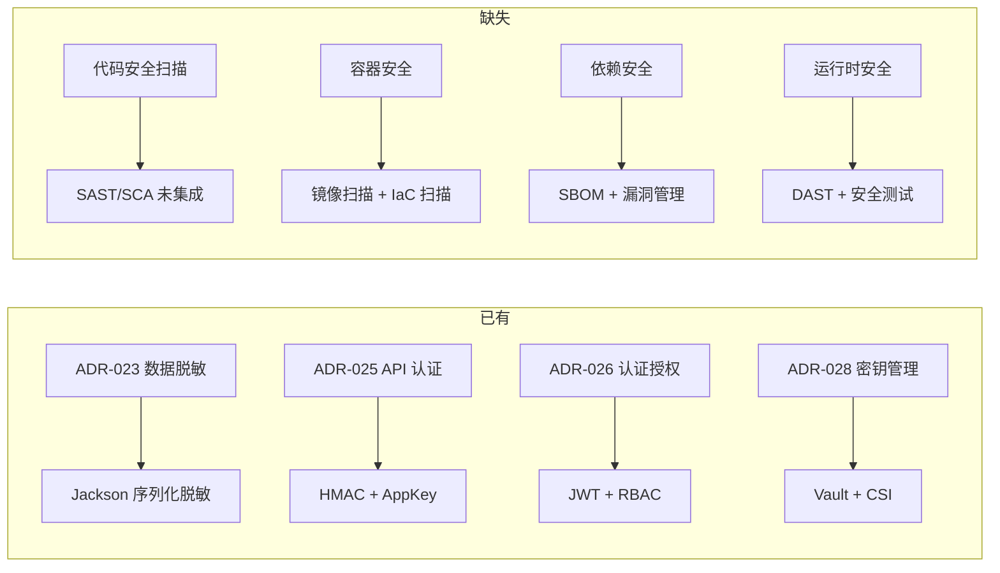
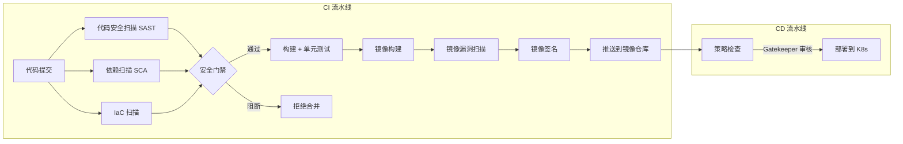

# DevSecOps 策略与安全左移

> 本文档补充订单中台架构中的 DevSecOps 实践。现有 ADR 覆盖了运行时安全（ADR-023 脱敏、ADR-025 API 认证、ADR-026 认证授权、ADR-028 密钥管理），但 CI/CD 流水线侧的安全左移尚未设计。本文档填补这一缺口。

---

## 1. 现状与缺口

### 当前安全实践



| 安全阶段 | 当前覆盖 | 缺失项 | 风险 |
|---------|---------|--------|------|
| **Code** | SonarQube 代码质量 | 无 SAST 安全扫描 | SQL 注入、XSS 等到运行时才暴露 |
| **Dependency** | Maven 常规依赖管理 | 无 SCA + SBOM | Log4Shell 类漏洞无感知 |
| **Build** | Maven 构建 | 无制品签名 + 完整性校验 | 构建产物可能被篡改 |
| **Image** | Docker build | 无镜像漏洞扫描 | 基础镜像含 CVE |
| **IaC** | 手工编写 | 无 Terraform/K8s 配置扫描 | 错误配置导致安全缺口 |
| **Deploy** | 手工审核 | 无策略即代码（OPA/Gatekeeper） | 不合规配置部署到生产 |
| **Runtime** | SkyWalking + Prometheus | 无 DAST + 渗透测试 | 运行态漏洞未发现 |

### 安全事件响应目标

```
发现到修复：P0 4h / P1 24h / P2 72h
漏洞修复 SLA：Critical 48h / High 7d / Medium 30d
SBOM 生成：每次构建自动生成
镜像扫描：每次推送自动执行
```

---

## 2. 流水线安全门禁

### 2.1 安全阶段架构



### 2.2 SAST — 静态应用安全测试

**工具选型**：SonarQube（已有）+ 安全规则插件

| 规则类别 | 检查项 | 阻断等级 |
|---------|--------|---------|
| SQL 注入 | MyBatis `${}` 拼接检测、JPA 原生 SQL 注入 | Critical |
| XSS | 前端响应中未转义用户输入 | Critical |
| RCE | `Runtime.exec()`、`ProcessBuilder`、SpEL 注入 | Critical |
| 路径遍历 | `File` 构造未校验用户输入 | High |
| 硬编码密钥 | 代码中直接出现的密码/Token/AK/SK | Critical |
| 不安全反序列化 | `readObject()`、Jackson `enableDefaultTyping` | High |
| 越权 | Controller 方法缺少 `@RequirePermission` | High |
| 目录遍历 | Resource URL 未做路径校验 | Medium |

**SonarQube 安全规则配置**：

```xml
<!-- pom.xml 扩展配置 -->
<plugin>
    <groupId>org.sonarsource.scanner.maven</groupId>
    <artifactId>sonar-maven-plugin</artifactId>
    <configuration>
        <properties>
            <!-- 启用所有安全热点 -->
            <property name="sonar.security.enabled" value="true"/>
            <!-- 自定义规则：硬编码密钥阻断 -->
            <property name="sonar.issue.ignore.multicriteria" value=""/>
            <!-- 规则级别定义 -->
            <property name="sonar.junit.reportPaths" value="target/surefire-reports"/>
        </properties>
    </configuration>
</plugin>
```

### 2.3 SCA — 依赖成分分析

**工具选型**：OWASP Dependency-Check + Maven 插件

```xml
<plugin>
    <groupId>org.owasp</groupId>
    <artifactId>dependency-check-maven</artifactId>
    <version>8.4.0</version>
    <configuration>
        <failBuildOnCVSS>7</failBuildOnCVSS>      <!-- CVSS >= 7 阻断构建 -->
        <failOnError>false</failOnError>           <!-- 工具自身错误不阻断 -->
        <formats>
            <format>HTML</format>
            <format>JSON</format>                  <!-- JSON 用于后续聚合 -->
        </formats>
        <suppressionFile>dependency-suppression.xml</suppressionFile>
    </configuration>
    <executions>
        <execution>
            <goals><goal>check</goal></goal>
        </execution>
    </executions>
</plugin>
```

**SBOM 生成**：

```xml
<!-- CycloneDX Maven Plugin -->
<plugin>
    <groupId>org.cyclonedx</groupId>
    <artifactId>cyclonedx-maven-plugin</artifactId>
    <version>2.7.6</version>
    <executions>
        <execution>
            <phase>package</phase>
            <goals><goal>makeAggregateBom</goal></goals>
        </execution>
    </executions>
    <configuration>
        <projectType>application</projectType>
        <schemaVersion>1.4</schemaVersion>
        <includeBomSerialNumber>true</includeBomSerialNumber>
        <includeCompileScope>true</includeCompileScope>
        <includeRuntimeScope>true</includeRuntimeScope>
    </configuration>
</plugin>
```

**SBOM 生命周期管理**：

- 每次构建生成 `bom.json` → 归档到 OSS
- 合并到每月全量 SBOM → 上传到 Dependency-Track 做连续监控
- 新 CVE 发布时 Dependency-Track 自动通知受影响服务 owner

### 2.4 镜像安全扫描

**工具选型**：Trivy（CI 阶段）+ Harbor 集成（仓库阶段）

```yaml
# .gitlab-ci.yml / GitHub Actions
container_scan:
  stage: security
  script:
    # 镜像扫描：阻断 Critical + High
    - trivy image --severity CRITICAL,HIGH --exit-code 1 --ignore-unfixed
      --vuln-type os,library
      $CI_REGISTRY_IMAGE:$CI_COMMIT_SHA
    # 如果 scanning 失败，阻断推送
    # 允许 Low/Medium 告警但不阻断
  only:
    - main
    - release-*
```

```yaml
# Trivy 忽略文件（.trivyignore）
# 经评估可接受的风险
CVE-2023-0001  # 不影响当前使用场景
CVE-2023-0002  # 需要 upstream 修复，跟进中
```

**基础镜像策略**：

```
基础镜像选择：Eclipse Temurin（Official）> AdoptOpenJDK > 自建
更新频率：每周自动 PR 升级基础镜像
版本策略：使用 minor tag（jdk17-jammy），不锁 patch（自动获得安全更新）
```

### 2.5 IaC 安全扫描

**工具选型**：Checkov + KICS（K8s manifest + Terraform）

```yaml
# IaC 扫描阶段
iac_scan:
  stage: security
  script:
    # 扫描 K8s manifest（安全检查 + 合规检查）
    - checkov -d k8s/ --framework kubernetes --skip-check CKV_K8S_16  # 跳过 namespace 检查
    # 扫描 Terraform（基础设施配置）
    - checkov -d terraform/ --framework terraform
    # 扫描 Dockerfile
    - checkov -f Dockerfile --framework dockerfile
  only:
    changes:
      - k8s/**/*
      - terraform/**/*
      - Dockerfile
```

**Checkov 阻断策略**：

```yaml
# .checkov.yml 配置
compact: true
quiet: true
skip-check:
  # K8s namespace 默认规则（使用已有 namespace）
  - CKV_K8S_16
  - CKV_K8S_21  # 跳过 default service account 检查（由 OPA 统一管理）
soft-fail: false  # 失败即阻断
framework:
  - kubernetes
  - terraform
  - dockerfile
```

| 检查类别 | 典型阻断项 | 严重度 |
|---------|----------|--------|
| K8s Pod | `privileged: true`、`hostPID: true`、`runAsRoot` | Critical |
| K8s 网络 | `NetworkPolicy` 缺失、Pod 暴露 `0.0.0.0/0` | High |
| K8s 存储 | PVC 未加密、hostPath 挂载 | High |
| K8s RBAC | `ClusterRoleBinding` 权限过大 | High |
| TLS/SSL | 禁止 TLS 1.0/1.1、证书过期 | High |
| Terraform | Bucket 公开访问、安全组规则过宽 | Critical |

### 2.6 策略即代码（OPA / Gatekeeper）

**关键策略**：

```rego
# 策略：必须设置 resource limits
package k8s.resources

violation[{"msg": msg}] {
    container := input.request.object.spec.containers[_]
    not container.resources.limits
    msg := sprintf("Container %v must have resource limits set", [container.name])
}

# 策略：禁止 latest 镜像标签
package k8s.imagetag

violation[{"msg": msg}] {
    container := input.request.object.spec.containers[_]
    endswith(container.image, ":latest")
    msg := sprintf("Container %v uses :latest tag", [container.name])
}

# 策略：必须设置 PodDisruptionBudget
package k8s.pdb

violation[{"msg": msg}] {
    input.request.kind.kind == "Deployment"
    input.request.object.spec.replicas > 1
    not data.inventory.namespace[input.request.namespace].PodDisruptionBudget[_]
    msg := sprintf("Deployment %v with >1 replica must have PDB", [input.request.object.metadata.name])
}
```

**Gatekeeper 部署**：

```yaml
# constraint-template.yaml
apiVersion: templates.gatekeeper.sh/v1
kind: ConstraintTemplate
metadata:
  name: k8srequiredresources
spec:
  crd:
    spec:
      names:
        kind: K8sRequiredResources
  targets:
    - target: admission.k8s.gatekeeper.sh
      rego: |
        package k8srequiredresources
        violation[{"msg": msg}] {
          container := input.review.object.spec.containers[_]
          not container.resources.limits
          msg := sprintf("Container <%v> must specify resource limits", [container.name])
        }
---
# constraint.yaml
apiVersion: constraints.gatekeeper.sh/v1beta1
kind: K8sRequiredResources
metadata:
  name: require-resource-limits
spec:
  match:
    kinds:
      - apiGroups: [""]
        kinds: ["Pod"]
    namespaces:
      - "prod-*"
  parameters:
    exemptImages:
      - "gcr.io/k8s-pause*"
```

---

## 3. 运行时安全补充

### 3.1 DAST — 动态安全测试

**工具选型**：ZAP（免费，Jenkins 集成）

```
频率：每两周一次 / 大促前全量扫描
范围：Gateway 暴露的 API 端点（内/外 Gateway）
认证：扫描器配置 JWT Token，模拟已认证用户
模式：
  - Spider：爬取 API 端点
  - Active Scan：SQL 注入、XSS、CSRF、路径遍历
  - Fuzzing：参数模糊测试
```

### 3.2 渗透测试策略

| 测试类型 | 频率 | 范围 | 执行方 |
|---------|------|------|--------|
| 自动化 DAST | 每两周 | 全部 API 端点 | CI/CD 集成 |
| 人工渗透 | 每季度 | 核心交易链路 | 安全团队/第三方 |
| 大促前专项 | 大促前 2 周 | 全链路 + 容量 + 安全 | 联合团队 |
| Red Team | 每年 | 不限范围模拟真实攻击 | 第三方 |

### 3.3 安全运维

**漏洞管理流程**：

```
发现漏洞
  → 评估影响范围（是否有 SBOM / 依赖图谱？）
  → 分类定级（CVSS + 业务影响）
  → 创建工单（P0-P3 对应 SLA）
  → 修复 + PR
  → 安全团队验证
  → 部署 + 确认关闭
```

**漏洞响应 SLA**：

| 严重度 | 修复 SLA | 部署 SLA | 通知方式 |
|--------|---------|---------|---------|
| Critical (CVSS 9-10) | 48h | 修复后 4h | 电话 + 群 @所有人 |
| High (CVSS 7-8.9) | 7d | 修复后 24h | 群 @owner |
| Medium (CVSS 4-6.9) | 30d | 下个发布窗口 | Jira 工单 |
| Low (CVSS 0-3.9) | 90d | 下个迭代 | 技术债 |

### 3.4 制品签名与完整性

```bash
# 构建完成后对 jar 签名
gpg --batch --yes --sign --detach-sign --armor
    --default-key "OMPLATFORM_BUILD@example.com"
    --output target/app.jar.asc target/app.jar

# 验证签名
gpg --verify app.jar.asc app.jar
```

```xml
<!-- Maven GPG 插件 -->
<plugin>
    <groupId>org.apache.maven.plugins</groupId>
    <artifactId>maven-gpg-plugin</artifactId>
    <version>3.1.0</version>
    <executions>
        <execution>
            <id>sign-artifacts</id>
            <phase>verify</phase>
            <goals><goal>sign</goal></goals>
        </execution>
    </executions>
</plugin>
```

---

## 4. CI/CD 集成

### 4.1 安全 Stage 整合（Jenkinsfile）

```groovy
pipeline {
    agent any
    stages {
        stage('Build') {
            steps {
                sh 'mvn clean package -DskipTests'
            }
        }
        stage('Security') {
            parallel {
                stage('SAST') {
                    steps {
                        sh 'mvn sonar:sonar -Dsonar.host.url=$SONAR_URL'
                    }
                }
                stage('SCA') {
                    steps {
                        sh 'mvn dependency-check:check'
                    }
                }
                stage('IaC Scan') {
                    steps {
                        sh 'checkov -d k8s/ -d terraform/'
                    }
                }
                stage('SBOM') {
                    steps {
                        sh 'mvn org.cyclonedx:cyclonedx-maven-plugin:makeAggregateBom'
                        archiveArtifacts artifacts: 'target/**/bom.json'
                    }
                }
            }
        }
        stage('Container') {
            steps {
                sh 'docker build -t $IMAGE:$TAG .'
                sh 'trivy image --severity CRITICAL,HIGH --exit-code 1 $IMAGE:$TAG'
                sh 'docker push $IMAGE:$TAG'
            }
        }
        stage('Deploy') {
            steps {
                sh 'kubectl apply -f k8s/'
            }
        }
    }
}
```

### 4.2 安全门禁规则矩阵

```yaml
# 合并请求（MR）门禁
security_gates:
  merge_request:
    required:
      - sonar.quality_gate.passed == true        # SonarQube Quality Gate
      - dependency_check.cvss_max < 7             # 无 CVSS >= 7 漏洞
      - checkov.failed_count == 0                 # IaC 无阻断项
    optional:                                      # 告警但不阻断
      - trivy.critical_count == 0
      - cyclonedx.sbom_generated == true

  production_deploy:
    required:
      - all_merge_request_gates.passed == true
      - image_scan.critical_count == 0
      - image_scan.high_count < 3
      - artifact.signed == true
      - gatekeeper.dry_run.passed == true          # OPA 预检通过
```

---

## 5. 工具链选型汇总

| 阶段 | 工具 | 免费/商业 | 部署方式 | ADR/文档关联 |
|------|------|----------|---------|-------------|
| SAST | SonarQube（已有） | Community 免费 | 自托管 | CI 触发 |
| SCA | OWASP Dependency-Check | 免费 | Maven 插件 | CI 阶段 |
| SBOM 生成 | CycloneDX Maven Plugin | 免费 | Maven 插件 | CI 阶段 |
| SBOM 管理 | Dependency-Track | 免费 | Docker 部署 | 独立服务 |
| 镜像扫描 | Trivy | 免费 | CLI / CI 集成 | CI 阶段 |
| IaC 扫描 | Checkov | 免费 | CLI / CI 集成 | CI 阶段 |
| 策略引擎 | OPA / Gatekeeper | 免费 | K8s 准入 Webhook | K8s 部署 |
| DAST | ZAP | 免费 | CLI / Docker | 每两周 |
| 制品签名 | GPG + Maven GPG Plugin | 免费 | Maven 插件 | CI 阶段 |
| 密钥管理 | Vault（ADR-028） | 免费 | K8s CSI | 运行时 |

---

## 6. 实施计划

| 阶段 | 任务 | 工时 |
|------|------|------|
| **Phase 1**（基础门槛） | | 3.5d |
| | SonarQube 安全规则扩展（配置 SAST 规则集） | 0.5d |
| | OWASP Dependency-Check 集成到 CI | 0.5d |
| | Trivy 镜像扫描集成 | 0.5d |
| | Checkov IaC 扫描集成 | 0.5d |
| | CycloneDX SBOM 生成 | 0.5d |
| | 安全门禁配置（MR 阻断规则） | 0.5d |
| | 文档 + 验证 | 0.5d |
| **Phase 2**（增强） | | 3d |
| | Dependency-Track 部署 + SBOM 推送 | 1d |
| | OPA / Gatekeeper 部署 + 策略编写 | 1.5d |
| | ZAP DAST 集成 + 基线扫描 | 0.5d |
| **Phase 3**（持续运营） | | 2d |
| | 漏洞管理流程落地 | 0.5d |
| | 制品签名 + 完整性校验 | 0.5d |
| | 渗透测试 SOP + 首次测试 | 1d |

**合计**：8.5 人天

---

## 7. 上线检查清单

- [ ] SonarQube 安全规则扩展部署完毕
- [ ] CI 流水线 SCA 扫描自动执行，CVSS ≥ 7 阻断
- [ ] Trivy 镜像扫描在 CI 中生效，Critical/High 阻断
- [ ] Checkov IaC 扫描覆盖全部 K8s + Terraform 配置
- [ ] CycloneDX SBOM 每次构建自动生成并归档
- [ ] Dependency-Track 实例部署，SBOM 自动推送
- [ ] OPA / Gatekeeper 部署到 K8s 集群，关键策略生效
- [ ] ZAP DAST 基线扫描通过
- [ ] 制品 GPG 签名在 CI verify 阶段执行
- [ ] 安全门禁在 GitLab MR 中生效
- [ ] 漏洞管理流程文档化，SLA 定义清楚

---

## 8. 与现有文档的关联

| 文档 | 关系 |
|------|------|
| **ADR-026**（认证授权） | SAST 检查 Controller 是否缺少权限注解 |
| **ADR-028**（密钥管理） | Vault 为 CI 签名密钥提供安全存储 |
| **ADR-025**（API 网关） | DAST 扫描外部 Gateway 暴露的 API |
| **ADR-027**（可观测性） | 安全告警纳入统一告警体系 |
| **ADR-023**（数据脱敏） | SAST 检查 PII 字段是否标注 @Desensitize |
| **ADR-022**（灰度发布） | 灰度环境同样执行安全扫描 |
