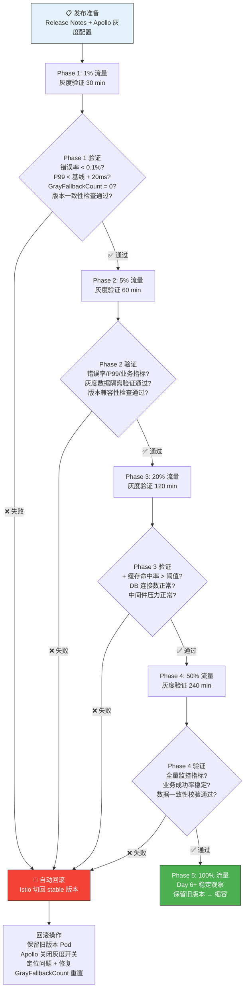

# 灰度发布流程

## 灰度策略说明

| 阶段 | 流量比例 | 等待/观察时间 | 验证重点 |
|------|---------|-------------|---------|
| Phase 1 | 1% | 30 min | Pod 健康检查、JVM 启动日志、GrayFallbackCount=0、版本一致性检查 |
| Phase 2 | 5% | 60 min | 错误率 < 0.1%、P99 < 基线 + 20ms、灰度数据隔离验证、版本兼容性检查 |
| Phase 3 | 20% | 120 min | 缓存命中率 > 阈值、DB 连接数正常、中间件压力正常 |
| Phase 4 | 50% | 240 min | 全量监控指标、业务成功率稳定、数据一致性校验 |
| Phase 5 | 100% | Day 6+ | 长期稳定观察、逐步缩容旧版本 |

## 回滚预案

| 回滚原因 | 检测条件 | 操作方式 | 恢复时间 |
|---------|---------|---------|---------|
| 代码 Bug | 错误率超标、P99 抖动 | K8s 重新部署旧版本镜像 | < 5 min |
| 配置错误 | GrayFallbackCount != 0 | Apollo 关闭灰度开关，回退配置 | < 1 min |
| 版本不一致 | 版本一致性检查失败 | Istio 切回 stable 版本 | < 1 min |
| DB 变更问题 | 数据隔离/一致性校验失败 | 只增字段不删不改 + 回滚代码 | < 10 min |
| 缓存/DB 过载 | 缓存命中率骤降、DB 连接数超限 | 切换 Feature Flag 降级 | < 1 min |
| 三方依赖故障 | 上游服务响应异常 | 切换 Feature Flag 降级 + 熔断 | < 1 min |

## 灰度数据隔离验证

- **数据隔离**: 灰度版本的请求仅路由到灰度 Pod，灰度日志/监控数据标记 `canary=true` 标签，与生产数据隔离存储。
- **数据一致性**: 灰度环境与生产环境共享同一存储层，通过灰度标识字段区分，确保灰度数据不影响生产数据完整性。
- **校验方式**: 对比灰度 Pod 与 stable Pod 的写库记录，校验无错写、无脏数据。

## 版本兼容性检查

- **接口兼容**: 灰度版本对外暴露的 RPC/HTTP 接口须向后兼容，新增字段需设置默认值。
- **DB Schema 兼容**: 仅允许 ADD COLUMN（无 NOT NULL 默认值）、不删不改已有字段。
- **缓存 Key 兼容**: 灰度版本不得变更现有缓存 Key 结构，如需变更须双写兼容期 ≥ 2 个观察窗口。
- **回滚兼容**: 灰度版本产生的数据/消息格式须能被 stable 版本正确解析，确保回滚后业务不中断。
