# CI/CD 流水线

```mermaid
graph LR
    %% 阶段 1：代码提交
    A["🔧 Checkout & Compile<br/>mvn compile -T 4<br/>2-5 min"] --> B["🧪 Unit Test<br/>JUnit 5 + Jacoco<br/>5-10 min"]

    %% 阶段 2：静态分析
    B --> C["🔍 Static Analysis<br/>SonarQube / Trivy / OWASP Dep<br/>3-8 min"]

    %% 阶段 3：镜像构建
    C --> D["🐳 Image Build & Scan<br/>Docker multi-stage + Cosign Sign<br/>3-6 min"]

    %% 阶段 4：集成测试
    D --> E["🔗 Integration Test<br/>Testcontainers + Contract<br/>5-15 min"]

    %% 阶段 5：环境部署
    E --> F{"环境部署"}

    F --> G["DEV<br/>自动部署"]
    G --> H["FAT<br/>自动部署"]
    H --> I["UAT<br/>手动触发"]
    I --> J["PRE<br/>审批部署 + 1% 灰度"]
    J --> K["PROD<br/>金丝雀 → 分批放量"]
    K --> L["DR<br/>手动触发"]

    %% 样式
    style K fill:#ff7f2a,stroke:#333,color:#fff
    style J fill:#ffcc00,stroke:#333
    style F fill:#e0e0e0,stroke:#333
```

## 流水线各阶段门禁

| 阶段 | 门禁条件 | 阻断策略 |
|------|---------|---------|
| **MR** | 编译通过 / 单元测试通过 / 覆盖率 ≥ 80% / SonarQube Quality Gate | ❌ 阻止合并 |
| **DEV 部署** | 编译通过 / 单元测试通过 / 镜像扫描通过 | ❌ 阻止部署 |
| **FAT 部署** | 集成测试通过 / 契约测试通过 | ❌ 阻止部署 + 群通知 |
| **PRE 部署** | 性能基线对比 / 压力测试 | ⚠️ 不阻断，需人工确认 |
| **PROD 部署** | 灰度验证通过 / 监控指标正常 / image_scan.critical_count == 0 / image_scan.high_count < 3 / artifact.signed == true / gatekeeper.dry_run.passed == true[^1] | 🔄 自动回滚 |

## 工具链说明

| 工具 | 用途 | 集成方式 |
|------|------|---------|
| GitLab CI | Pipeline 编排 | `.gitlab-ci.yml` |
| Maven | 编译构建 | `pom.xml` 多模块 |
| JUnit 5 + Mockito | 单元测试 | Surefire 插件 |
| JaCoCo | 覆盖率 | 单模块 ≥ 85%，整体 ≥ 80% |
| SonarQube | SAST 代码分析 | Quality Gate 阻断 |
| Trivy | 镜像 CVE 扫描 | High/Critical 阻断 |
| OWASP Dependency-Check | 三方库漏洞扫描 | CVSS ≥ 7.0 阻断 |
| Cosign | 镜像签名 | Vault PKI 管理签名私钥 (ADR-028)，流水线从 Vault 读取签名密钥进行签名 + 部署验证 |
| Testcontainers | 集成测试中间件 | JUnit 5 Extension |
| Pact | 契约测试 | Spring Cloud Contract |

[^1]: 生产部署安全门禁条件详见 devsecops-strategy.md 4.2 节。
