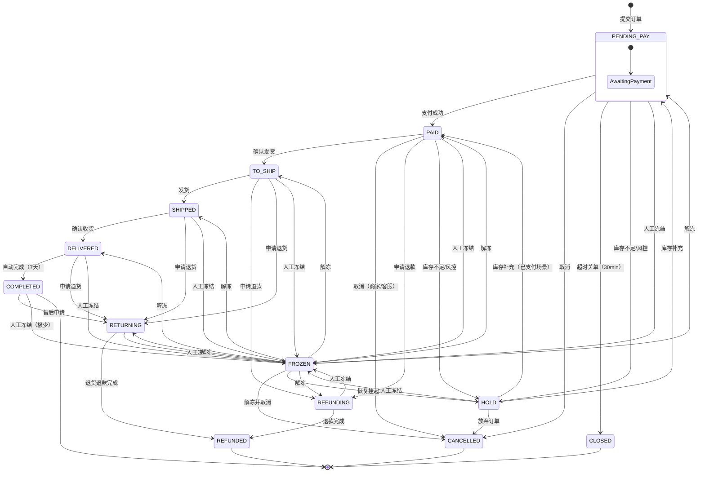

# 订单全生命周期状态机（13 态）

> 本文档基于 [ADR-039 订单全生命周期管理](../adr/ADR-039-order-lifecycle-management.md) 定义，覆盖订单从创建到完成/取消/退款的完整状态流转。

## 状态说明

| 状态 | 含义 | 是否终态 | 最大停留时间 | 超时处理 | 可操作角色 |
|------|------|---------|------------|---------|-----------|
| `PENDING_PAY` | 待支付 | 否 | 30 min | 自动关闭 → CLOSED | 买家：支付/取消 |
| `PAID` | 已支付 | 否 | 24 h | P2 告警（催促发货） | 商家：发货；买家：退款 |
| `TO_SHIP` | 待发货 | 否 | 72 h | P2 告警（超时未发货） | 商家：发货 |
| `SHIPPED` | 已发货 | 否 | 7 d | 自动确认 → DELIVERED | 买家：确认收货/退货 |
| `DELIVERED` | 已签收 | 否 | 7 d | 自动完成 → COMPLETED | 买家：退货 |
| `COMPLETED` | 已完成 | ✅ 是 | — | — | 只读 |
| `CANCELLED` | 已取消 | ✅ 是 | — | — | 只读 |
| `CLOSED` | 超时关闭 | ✅ 是 | — | — | 只读 |
| `REFUNDING` | 退款中 | 否 | 72 h | 触发对账 → P1 告警 | 系统：自动审核退款 |
| `RETURNING` | 退货中 | 否 | 15 d | 触发对账 → P1 告警 | 系统：审核退货 |
| `REFUNDED` | 已退款 | ✅ 是 | — | — | 只读 |
| `HOLD` | 挂起 | 否 | 48 h | P2 告警 | 系统：自动释放；商家：确认 |
| `FROZEN` | 冻结 | 否 | 无限制 | — | 管理员：解冻/取消 |

## 状态转换矩阵

行 = 当前状态，列 = 目标状态。`✅` = 合法转换，空白 = 非法。

| 当前 \ 目标 | PENDING_PAY | PAID | TO_SHIP | SHIPPED | DELIVERED | COMPLETED | CANCELLED | CLOSED | REFUNDING | RETURNING | REFUNDED | HOLD | FROZEN |
|------------|:-----------:|:----:|:-------:|:-------:|:---------:|:---------:|:---------:|:-----:|:---------:|:---------:|:--------:|:----:|:------:|
| **PENDING_PAY** | — | ✅ 支付 | | | | | ✅ 取消 | ✅ 超时 | | | | ✅ 库存不足 | ✅ 冻结 |
| **PAID** | | — | ✅ 发货 | | | | ✅ 取消 | | ✅ 退款 | | | ✅ 库存不足 | ✅ 冻结 |
| **TO_SHIP** | | | — | ✅ 发货 | | | | | ✅ 退款 | ✅ 退货 | | | ✅ 冻结 |
| **SHIPPED** | | | | — | ✅ 收货 | | | | | ✅ 退货 | | | ✅ 冻结 |
| **DELIVERED** | | | | | — | ✅ 完成 | | | | ✅ 退货 | | | ✅ 冻结 |
| **COMPLETED** | | | | | | — | | | | ✅ 售后 | | | ✅ 冻结 |
| **CANCELLED** | | | | | | | — | | | | | | |
| **CLOSED** | | | | | | | | — | | | | | |
| **REFUNDING** | | | | | | | | | — | | ✅ 完成 | | ✅ 冻结 |
| **RETURNING** | | | | | | | | | | — | ✅ 完成 | | ✅ 冻结 |
| **REFUNDED** | | | | | | | | | | | — | | |
| **HOLD** | ✅ 解除 | ✅ 解除 | | | | | ✅ 取消 | | | | | — | ✅ 冻结 |
| **FROZEN** | ✅ 解冻 | ✅ 解冻 | ✅ 解冻 | ✅ 解冻 | ✅ 解冻 | | ✅ 取消 | | ✅ 解冻 | ✅ 解冻 | | ✅ 解冻 | — |

## 禁止转换示例

状态机引擎强制拦截以下非法转换：

| 场景 | 非法转换 | 原因 |
|------|---------|------|
| 回退支付 | `PAID → PENDING_PAY` | 支付成功后不能回退 |
| 回退发货 | `SHIPPED → TO_SHIP` | 发货后不可撤销发货动作 |
| 完成后退款 | `COMPLETED → REFUNDING` | 完成后走售后流程，非直接退款 |
| 取消后支付 | `CANCELLED → PAID` | 取消的订单不可再支付 |
| 未支付发货 | `PENDING_PAY → SHIPPED` | 跳过支付和待发货 |
| 终态变更 | `COMPLETED/REFUNDED → 任何态` | 终态不可逆 |
| 取消后退货 | `CANCELLED → RETURNING` | 已取消不能再退货 |

## 设计决策

| 决策 | 内容 | 依据 |
|------|------|------|
| **新增 HOLD 态** | PENDING_PAY/PAID → HOLD（库存不足/风控） | 独立状态简化卡单检测，显式标记异常 |
| **新增 RETURNING 态** | 与 REFUNDING 区分（退货 vs 仅退款） | 超时规则不同（退货 15d > 退款 72h） |
| **新增 FROZEN 态** | 所有非终态可冻结，管理员操作 | 客服锁定异常订单，防自动操作 |
| **终态不可逆** | COMPLETED/CANCELLED/CLOSED/REFUNDED 出边仅 FROZEN | 数据完整性，防止终态数据被篡改 |
| **FROZEN 可双向** | 冻结→任意原态；解冻时恢复到 previous_status | 冻结是"暂停"，不是"终止" |

## 架构决策追踪

| ADR | 状态 | 说明 |
|-----|------|------|
| **ADR-039** | ✅ **已覆盖** | 订单全生命周期管理（本文）—— 定义 13 态状态机、核心原子服务、异常处理机制 |
| ADR-037 | 🔗 集成 | 流程引擎显式声明状态转换，调用状态机引擎校验合法性 |
| ADR-020 | 🔗 集成 | Saga 步骤通过状态机引擎执行转换，补偿时可跳过守卫 |
| ADR-021 | 🔗 集成 | 支付超时（30min）、自动确认（7d）使用延迟任务框架 |
| ADR-030 | 🔗 集成 | 原子服务继承 `Idempotency-Key` 幂等校验 |

## 相关文档

- 📄 [ADR-039 订单全生命周期管理](../adr/ADR-039-order-lifecycle-management.md) — 状态机引擎 + 原子服务 + 异常处理详细设计
- 📊 [状态机全图](state-machine-full.puml) — 13 态状态机 PlantUML 全景图
- 📊 [状态机转换流程](sequence/state-machine-transition.puml) — 状态机引擎调用时序图
- 📊 [拆单合单流程](sequence/order-split-merge.puml) — 原子服务拆合单时序图
- 📊 [异常处理流程](sequence/order-exception-handling.puml) — HOLD/超时/卡单检测/人工干预

> **变更记录**：2026-06-13 从 10 态状态机升级为 13 态（新增 HOLD / RETURNING / FROZEN），添加 N×N 转换矩阵和状态超时定义。基于 ADR-039。
